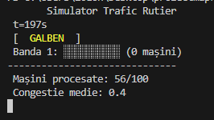
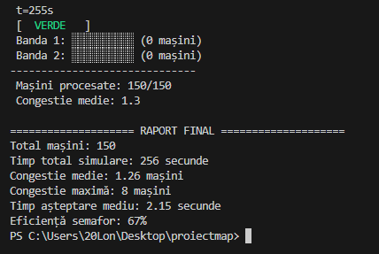
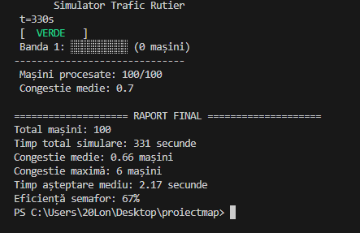
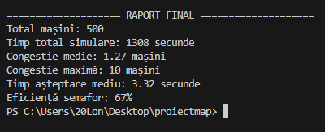
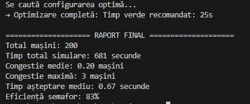
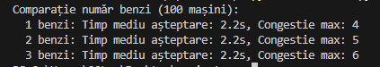

# 🚦 Simulator de Trafic Rutier (Tema 16)

Acest proiect este o implementare a unui simulator de trafic rutier bazat pe evenimente discrete (Python). Aplicația modelează fluxul de vehicule la semafoare, simulând congestia, calculând timpii de așteptare și oferind algoritmi pentru optimizarea ciclurilor de semaforizare.

## 📝 Descriere

Proiectul are ca scop înțelegerea simulărilor discrete și a teoriei cozilor.
**Ce face aplicația:**
* Modelează sistemul de transport secundă cu secundă.
* Generează trafic folosind distribuții probabilistice.
* Calculează statistici de performanță (timp așteptare, congestie).
* Vizualizează traficul în timp real în consolă (ASCII art).
* Optimizează automat timpii semaforului.

---

## 🚀 Instalare și Utilizare

Asigură-te că ai **Python 3.x** instalat. Fișierul principal este `simulator.py`.

### 1. Simulare cu Vizualizare (Mod Standard)
Rulează o simulare grafică (text) pentru a vedea cum se comportă mașinile la semafor.

```bash
python simulator.py --cars 100 --light_cycle 30 --lanes 1 --viz
```

**Previzualizare în timp real:**
Mai jos se poate observa starea semaforului (Galben) și coada formată pe banda 1.



Vizualizare pentru modul cu 2 benzi (Semafor Verde):



### 2. Rapoarte și Statistici
După finalizarea simulării, se generează un raport detaliat.

**Exemplu Raport (100 mașini):**


**Exemplu Raport Volum Mare (500 mașini):**
Pentru teste de performanță, se poate rula fără vizualizare (`--viz` omis) pentru viteză.
```bash
python simulator.py --cars 500 --light_cycle 30
```


---

## ⚙️ Funcționalități Avansate

### ✅ Optimizare Automată
Simulatorul poate căuta singur cea mai bună configurație pentru timpul de verde, astfel încât să minimizeze congestia.

```bash
python simulator.py --optimize --cars 200
```

**Rezultat Optimizare:**
Sistemul analizează diverse scenarii și recomandă timpul ideal.


### 📊 Comparare Benzi de Circulație
Poți compara eficiența traficului între 1, 2 sau 3 benzi pentru același volum de mașini.

```bash
python simulator.py --lanes 2 --compare "1,2,3"
```

**Rezultat Comparație:**
Se observă cum timpul de așteptare scade drastic odată cu adăugarea benzilor.


---

## 📈 Semnificația Statisticilor

| Indicator | Descriere |
| :--- | :--- |
| **Congestie medie** | Numărul mediu de mașini care așteaptă la semafor pe durata simulării. |
| **Congestie maximă** | Cel mai mare număr de mașini aflate în coadă la un moment dat. |
| **Timp așteptare mediu** | Durata medie (secunde) pe care o mașină o petrece stând la coadă. |
| **Eficiență semafor** | Procentul din timpul de "Verde" care a fost folosit efectiv de mașini. |

---

## 💻 Cerințe Tehnice
* Limbaj: Python 3
* Biblioteci standard: `time`, `random`, `argparse`, `collections` (nu necesită instalări externe).
